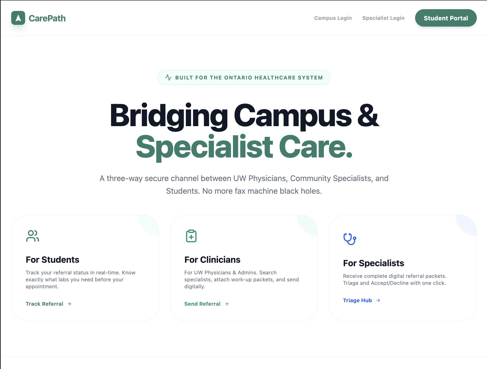

# CarePath 🏥



**CarePath** is a streamlined, intelligent healthcare referral system designed to bridge the gap between campus clinicians and community specialists. Specifically tailored for the University of Waterloo ecosystem, it simplifies the complex referral journey for students while providing clinicians with a robust tracking and requirement-management tool.

🏆 **Award Winner:** CarePath was honored with the **Outstanding Pivot Award** at the **Velocity Cornerstone Finals**.

## 🌟 Key Features

- **Requirement-Smart Search:** A specialized directory that highlights exactly what bloodwork, documentation, or imaging a specialist requires *before* an appointment is booked, reducing administrative friction.
- **Live Referral Tracker:** Students can track their referral status in real-time (Sent → Triage → Decision), providing transparency and reducing anxiety during the specialist journey.
- **Multi-Role Ecosystem:**
  - **Students:** Find specialists and track their own healthcare journey.
  - **Referrers (UW Doctors/Admin):** Manage outgoing referrals and ensure documentation meets specialist standards.
  - **Specialists:** Receive high-quality, pre-vetted referrals with all necessary documentation attached.
- **OHIP & Private Integration:** Seamlessly handles both public and private healthcare coverage types common in student populations.

## 🚀 Tech Stack

- **Frontend:** React 19, TypeScript, Vite
- **Backend:** Java 17+, Spring Boot 3, Spring Data JPA
- **Database:** PostgreSQL 15
- **Authentication:** Firebase Authentication (Google Login)
- **Security:** Spring Security (OAuth2 Resource Server), Firebase JWT Validation
- **Infrastructure:** Docker, Docker Compose
- **Styling:** Tailwind CSS
- **Icons:** Lucide React

## 🛠️ Getting Started

### Prerequisites
- Node.js & npm
- Java 17+ & Maven
- Docker & Docker Compose

### 1. Infrastructure & Database
Spin up the PostgreSQL database using Docker:
```bash
docker-compose up -d
```

### 2. Backend Setup
Configure your JWT issuer in `backend/src/main/resources/application.yml`, then run:
```bash
cd backend
mvn spring-boot:run
```

### 3. Frontend Setup
Install dependencies and start the development server:
```bash
npm install
npm run dev
```

## 🛡️ Security & Compliance
CarePath is built with healthcare-grade security principles:
- **UUID v4 Primary Keys:** Prevents URL enumeration and ID guessing attacks.
- **Stateless Authentication:** Secure JWT validation via Spring Security.
- **Audit Logging:** Automated tracking of all sensitive data access for PHIPA/HIPAA compliance.
- **Role-Based Access Control (RBAC):** Strict data isolation between Students, Referrers, and Specialists.

## 📈 The Pivot
CarePath was recognized at the Velocity Cornerstone Finals for its strategic pivot from a general health app to a targeted, high-impact solution for the specific "referral black hole" experienced by university students and campus health clinics. By focusing on the *requirements* of specialists, we significantly reduced the rate of rejected referrals.

---
*Developed for the Waterloo Healthcare Community🫀.*
